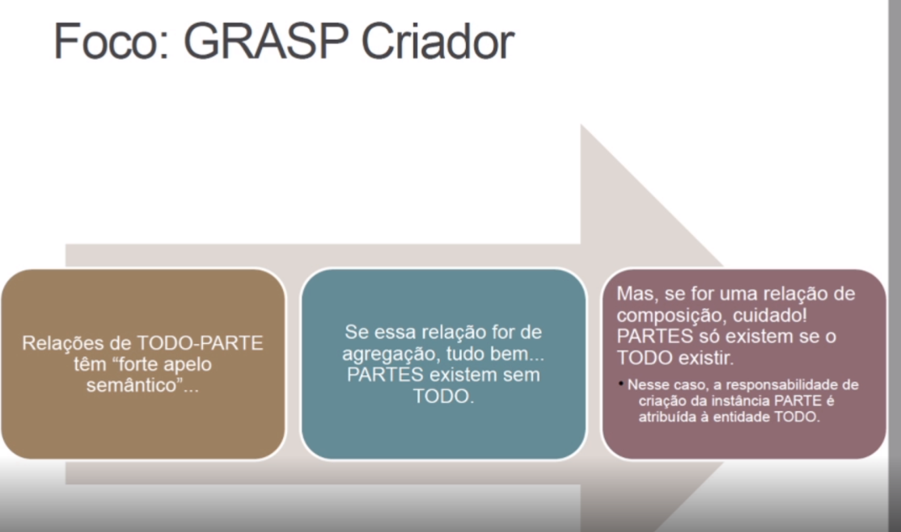

# Arquitetura e desenho de software

## GRASPS
General Responsability Assignment Software Patterns(Grasps)

### Creator

Relação Todo - Parte.

A própria classe não tem autonomia para se criar.

A classe todo cria.

#### Related patterns
- Factory

### Controler

Creator is a controller focused on create instances.

Semantic composition.

Who is the best one to: sort ? insert? calculate ?

#### Related patterns
- Command
- Facade
- Layers
- Pure Fabrication

### Polymorphism

...

### Indirection

Supports low coupling and reuses potential between two elements by
assinging the responsibility of mediation between them to an 
intermediate object. I.E. model and view.

## GoF

Uma solução consolidada para um problema recorrente no desenvolvimento
orientado a objetos.

### Criacionais

#### Factory

Encapsula a escolha da classe concreta ser utilizada na criação de
objetos de um determinado tipo.

#### Abstract Factory

Encapsula a escolha das classes concretas a serem utilizadas na 
criação de objetos de diversas famílias.

#### Builder

Separa o processo de construção de um objeto de sua apresentação e 
permite sua apresentação e criação passo a passo. Diferentes tipos
de objetos podem ser criados com implementações distintas de cada
passo.

#### Prototype

Possibilita criar novos objetos a partir da cópia de objetos 
existentes.

#### Singleton

Permite criar apenas uma instância da classe e implementa um modo de
recuperá-la.

#### Mutiton

Permite criar apenas um conjunto limitado de instâncias da classe
e implementa um modo de recuperá-la.

#### Object Pool

Possibilita o reaproveitamento de objetos.

