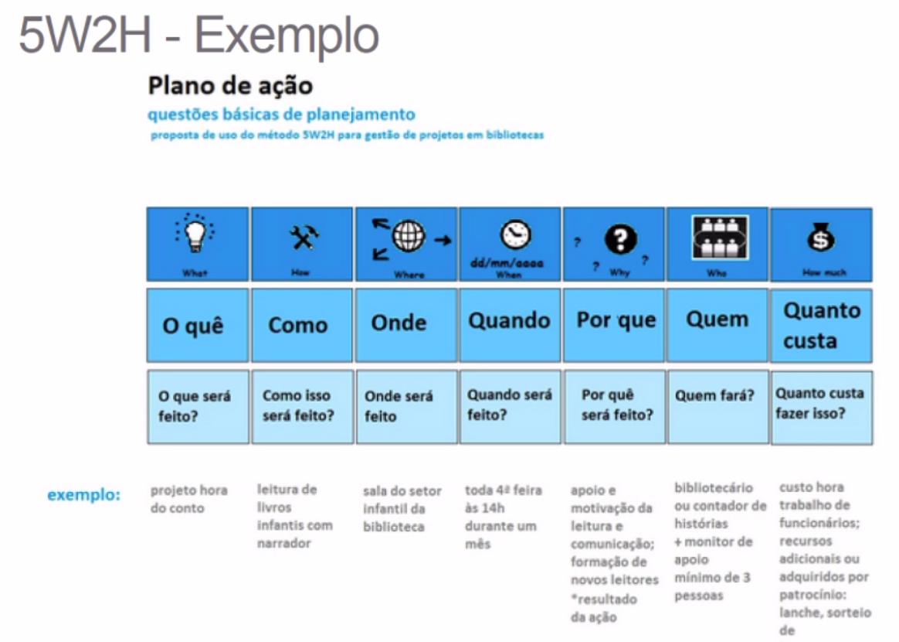
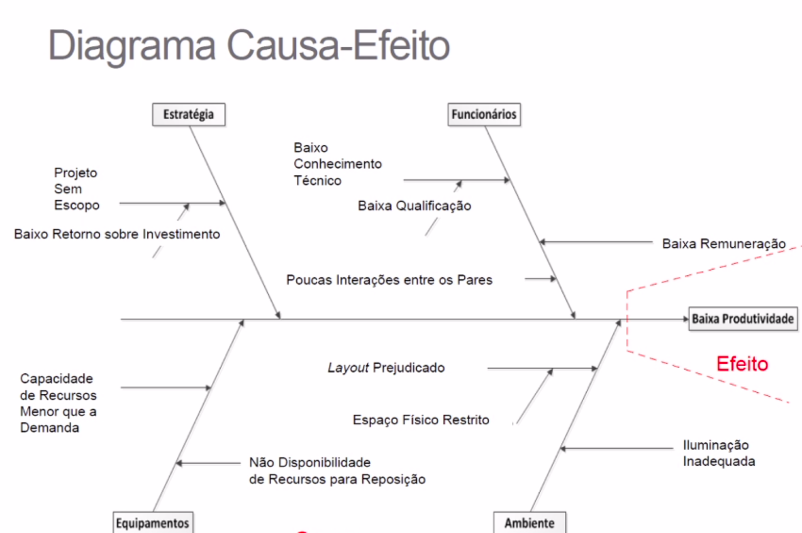
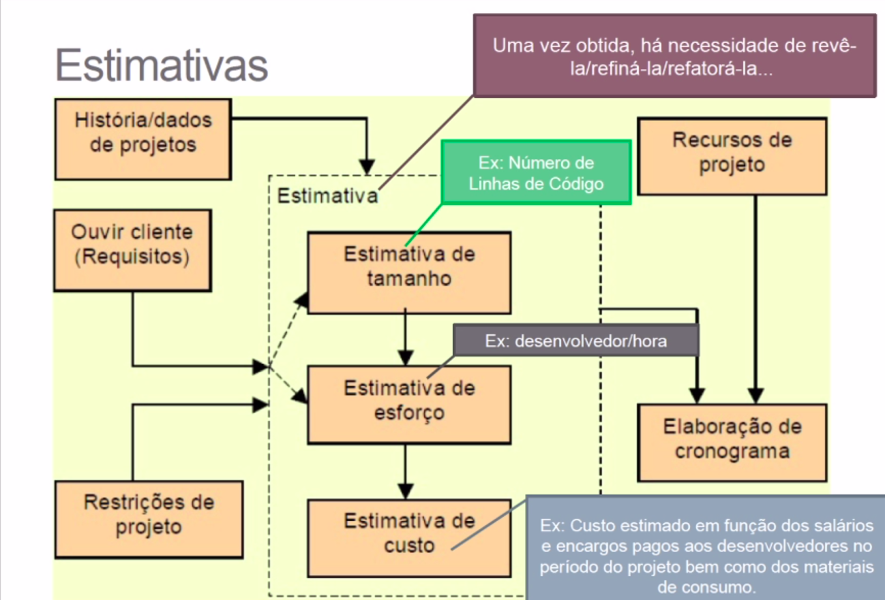
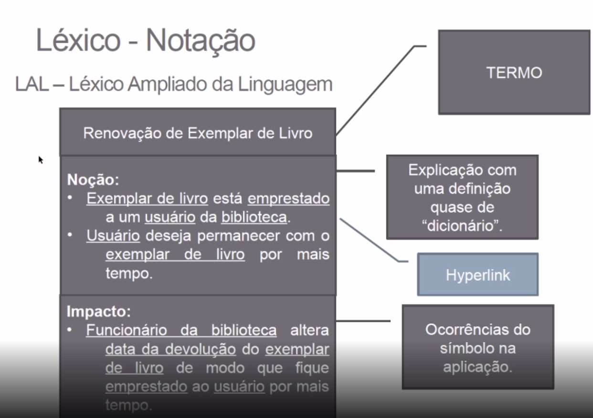
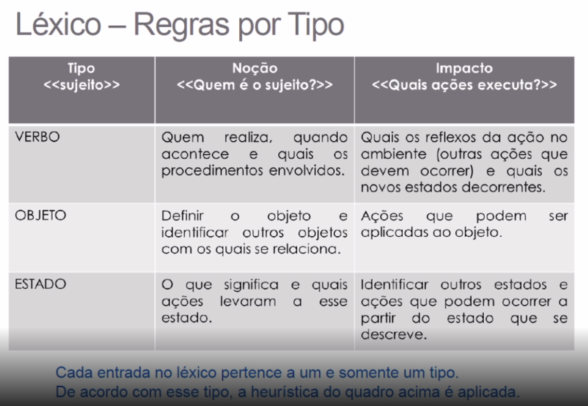

# Arquitetura e desenho de software

## 5W2H

Framework conceitual.

- What ?
- Why ?
- Who ?
- Where ?
- When ?
- How ?
- How Much ?

## Rich Picture

Modelagem de ideias, pouco informal. Sao desenhos e textos, normalmente 
feitos a mao livre.

## Diagrama Causa-Efeito \<Ishikawa\>

- Propor acoes corretivas
- Acompanhar acoes corretivas
- Gerar relatorio do problema

## Estimativas

- Habilidades dos desenvolvedores
- Recursos financeiros
- Prazos

## Glossario e lexicos

Glossario = (nome: definicao).

Lexico = (Termo, definicao, ocorrencia do simbolo na aplicacao)

-> hyperlinks de termos.

## Design Sprint

### Unpack
- Insights com a participacao de todos.
- Levantamenteo rasoavel do escopo do projeto.
- Pode ser documentado com mapas mentais.

### Sketch

- Desenhos de varias ideias, ex: rich picture, story board.

### Decision

- Escoler a melhor ideia

### Prototype

- Criar o prototipo e validar.