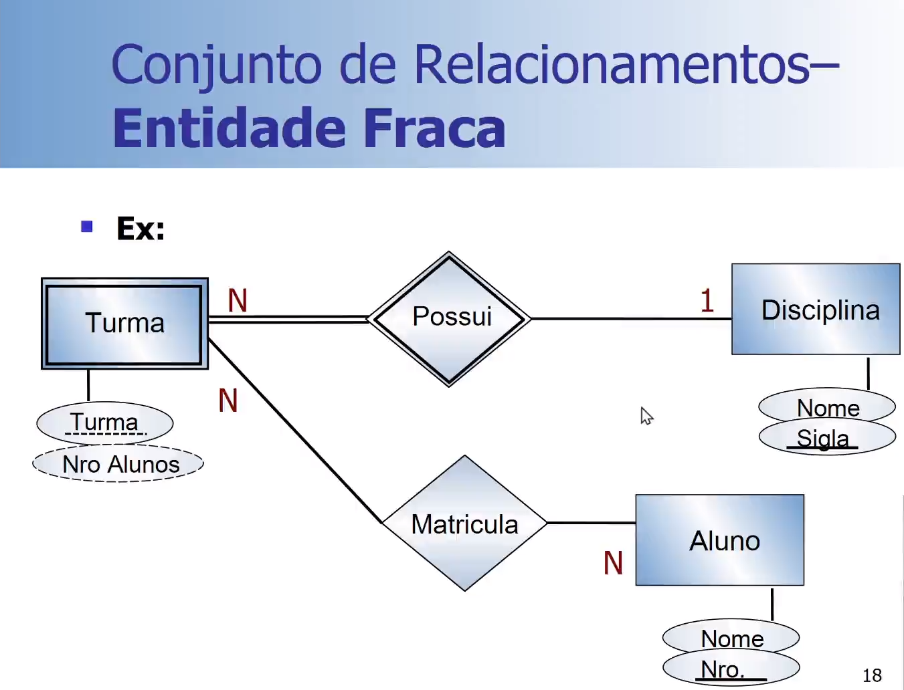
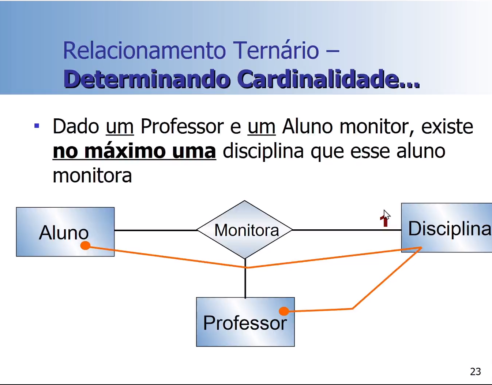
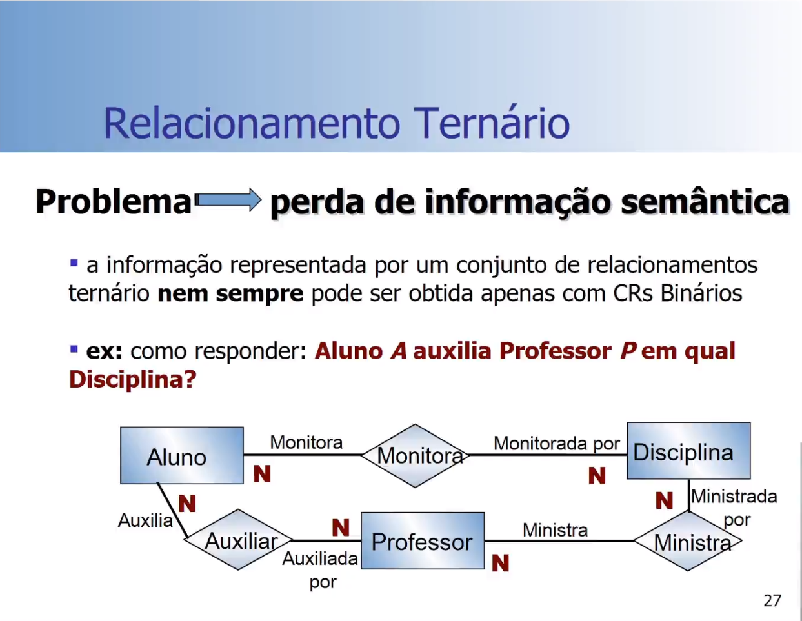
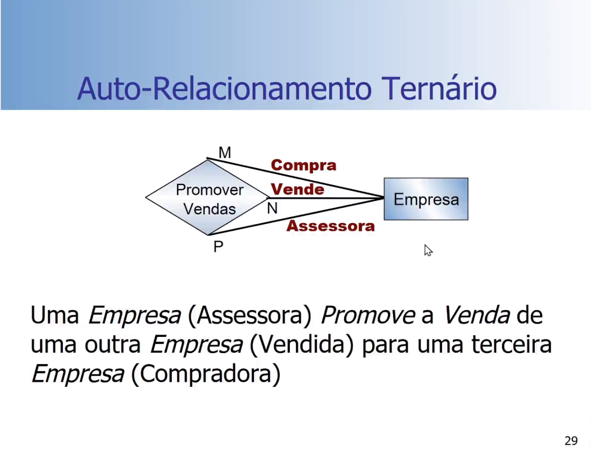
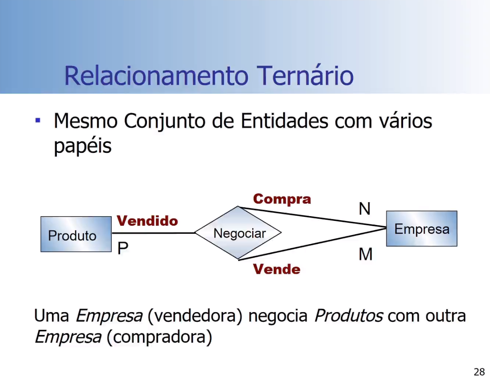
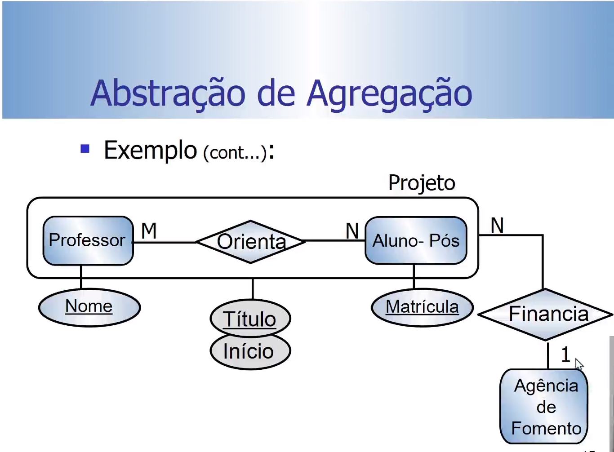
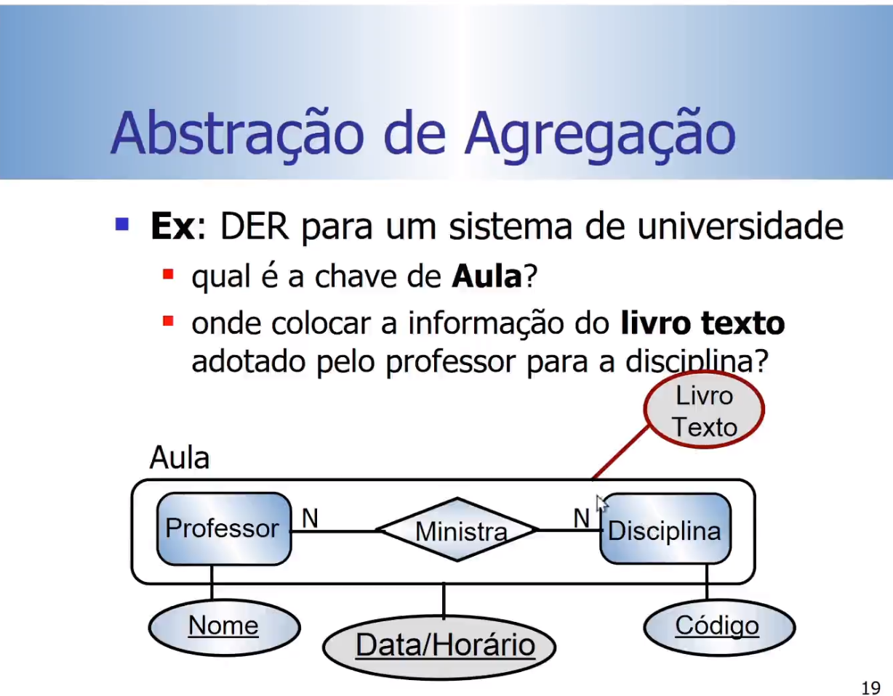
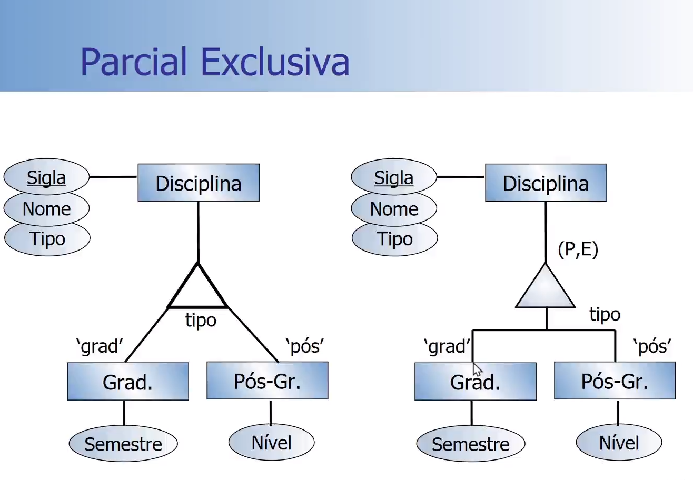
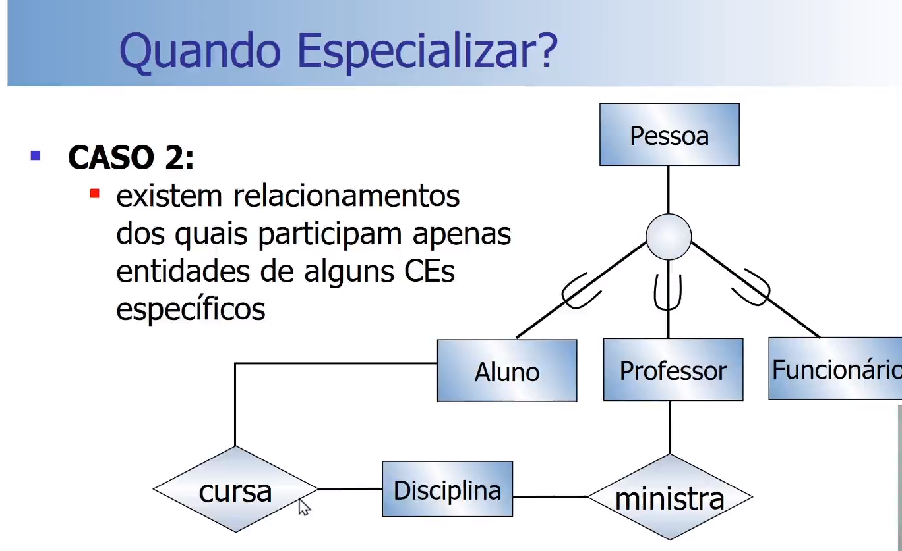
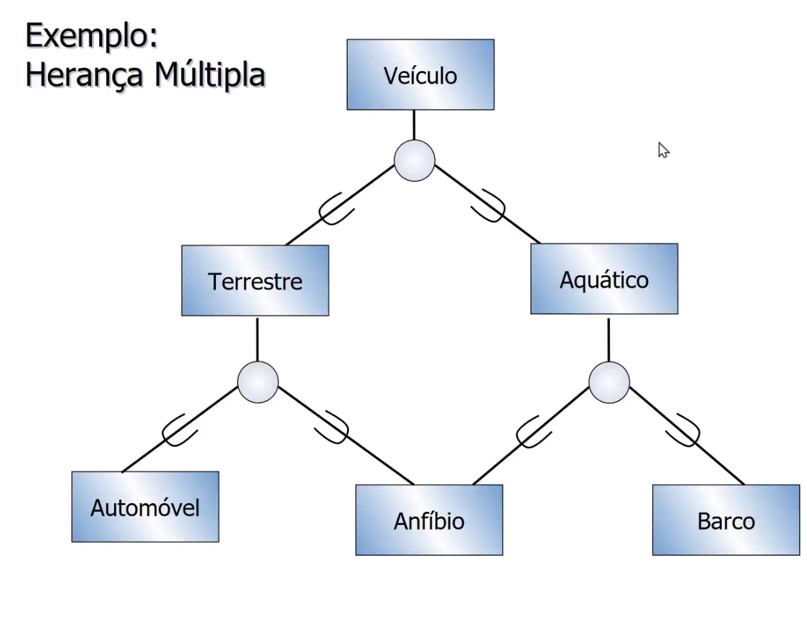

# Init stage.

Esquema -> Definicao do banco. Metadados.

Three-Schema Architecture.

- Multiplas visoes para usuarios.
- Armazenamento da descricao da base de dados em diferentes niveis de abstracao.
- Independencia de dados.

# Modelo do banco

- Esquema Conceitual
- Esquema Logico
- Esquema Fisico

## Esquema Fisico

- Tempo de resposta
- Espaco utilizado
- Numero de transacoes

# MER & MER-X

## Entidades Fracas

Geralmente nao possuem chave primaria, mas usam um atributo para complementar a chave da entidade forte.

## Relacionamento Ternario

E possivel quebrar o ternario em binarios, mas a semantia e o processamento das operacoes pode ser prejudicada.

Eles tambem podem ter auto relacionamentos.

Ternario complexo.

## Abstracao de Agregacao.

Geralmente acontece quando vc quer relacionar um relacionamento a outras entidades. Ou quando o Conjunto de Relacionamentos tem um identificador proprio. 

A semantica pode ser alterada totalmente, dependendo de onde e colocado o atributo. 

# Generalizacao & Especializacao.

Especializacao com Restricao de 
- Disjuncao: Disciplina so pode ser de graduacao ou pos-graduacao. (D)
- Sobreposicao\[Overlap\]: um funcionario pode acumular mais de uma funcao ao mesmo tempo.(O)
- Especializacao Total: Qualquer disciplina e de pelomenos um tipo. (||)
- Especializacao Parcial: quando existe entidade que nao especializa. (|)

T, P -> total, parcial.
E,S -> exclusica, sobreposta.

# Modelo relacional

Relation Intension -> esquema, metadados.
Relation Extension -> instancias do banco.

Valores ATOMICOS: indivisivel, monovalorado.

Super chave: identifica de forma unica a tupla. Mais de um atributo.

Chave candidata: candidata a primaria.

Dominio do atributo:
- Nome.
- Definicao logica.
- Tipo de dado e formato. -> string com tres letras seguidas de um traco e de quatro digitos: FGA-0137

Grau -> numero de atributos.
Dom(Ai) -> dominio do atributo.
## Restricoes
- Dominio
- null para atributo
- unicidade( CHAVE )

Restricao de integridade da entidade: PK nao nula.
Restricao de integridade referencial: FK deve ser compativel.