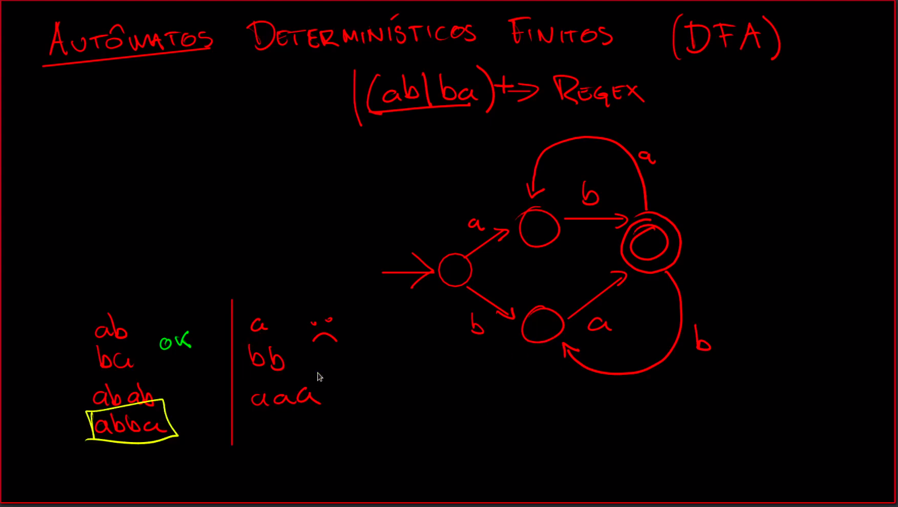

# Automatos Deterministicos Finitos (DFA)

Dois circulos concentricos = estado inicial valido.

Tabela de estados.

# Automatos nao Deterministicos Finitos (NFA)

Automatos deterministicos respeitam as regras:
- Unico estado inicial
- Faz no maximo uma transicao de saida por estado(simbolo)
- Cada transicao consome exatamente 1 simbolo

# Construcao de Thompson

