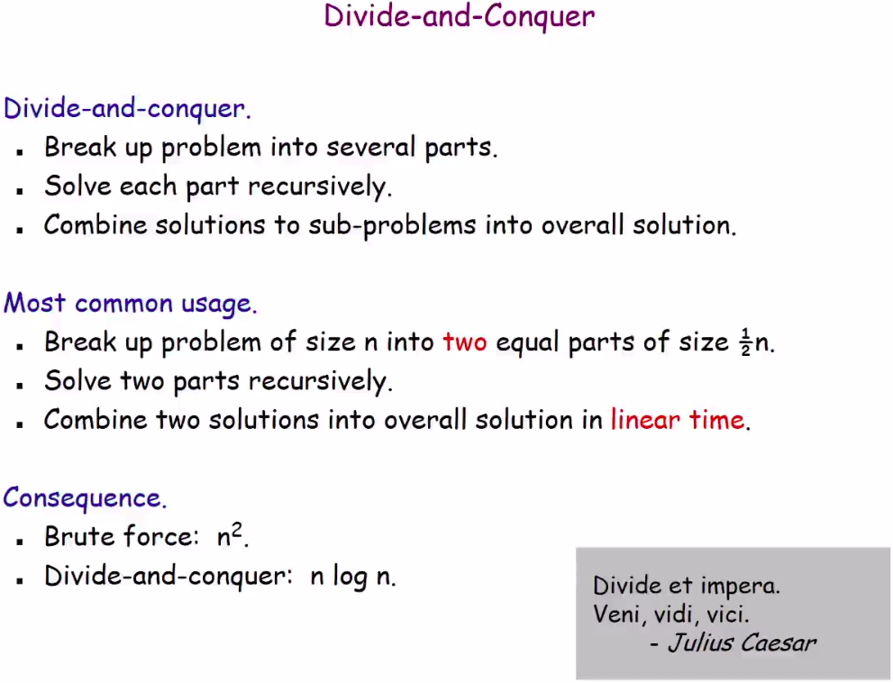

# Dividir para conquistar

Template padrao

## Complexidade computacional do merge sort

lorem.

# Counting Inversions

algoritmo

# Selection in Linear Time
Vulgo Mediana das medianas.
Encontrar o k-esimo elemento em um vetor nao ordenado
em tempo linear.

# Closest pair of points
