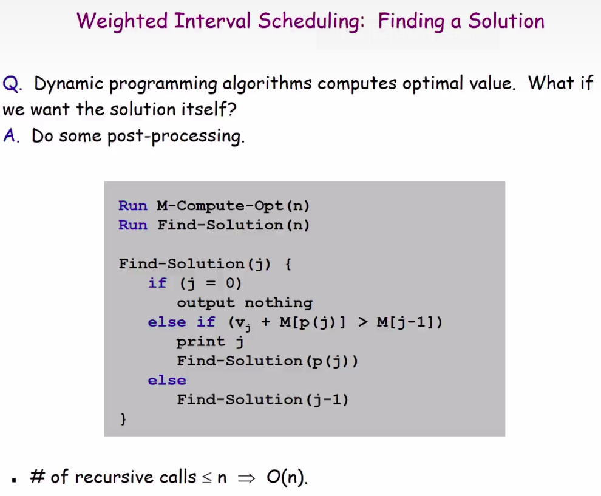
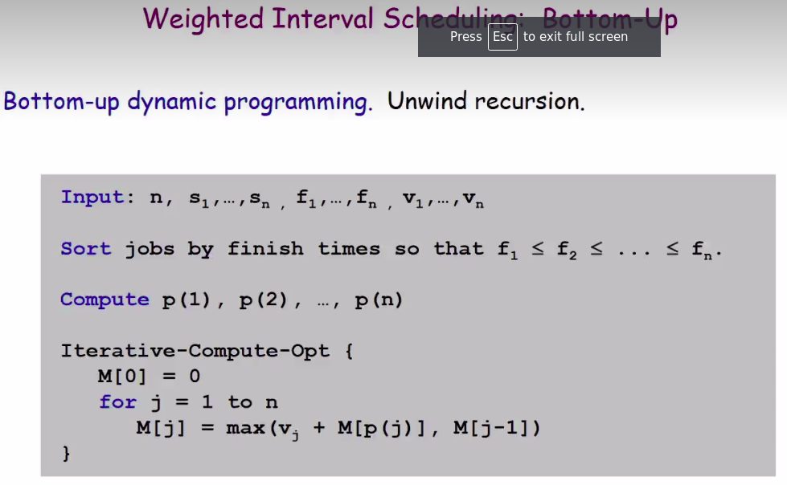
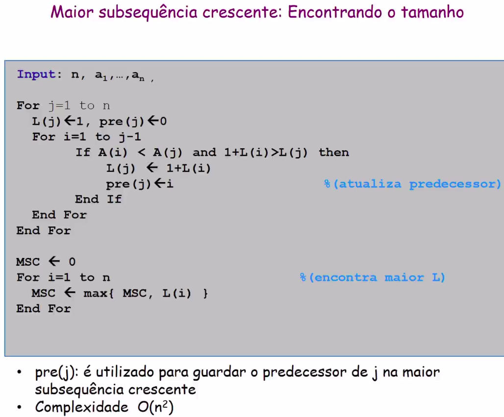

# Dynamic programming

Bellman : Pioneiro nos estudos da programacao dinamica, 1950.

O nome programacao dinamica e puro marketing.

## Aplicacoes

- Bellman-Ford: caminho mais curto em redes de computadores.
- Alinhamento de sequencia.
- Cocke-Kasami-Younger para parsers em gramaticas livres de contexto.

## Bruteforce VS DP

A DP e superior ao bruteforce porque ela combina as solucoes ja criadas.

## Como saber quais tarefas foram selecionadas

## Da pra fazer de modo iterativo.

# Maior Subsequencia crescente

# Bellman-Ford

O algoritmo de Bellman-Ford nao aceita ciclos com resultado negativos.

Ter um ciclo com arestas negativas que somadas sao >= 0 e aceitavel.

Tabela
- Linhas da tabela numero de arestas
- Colunas da tabela numero do no.