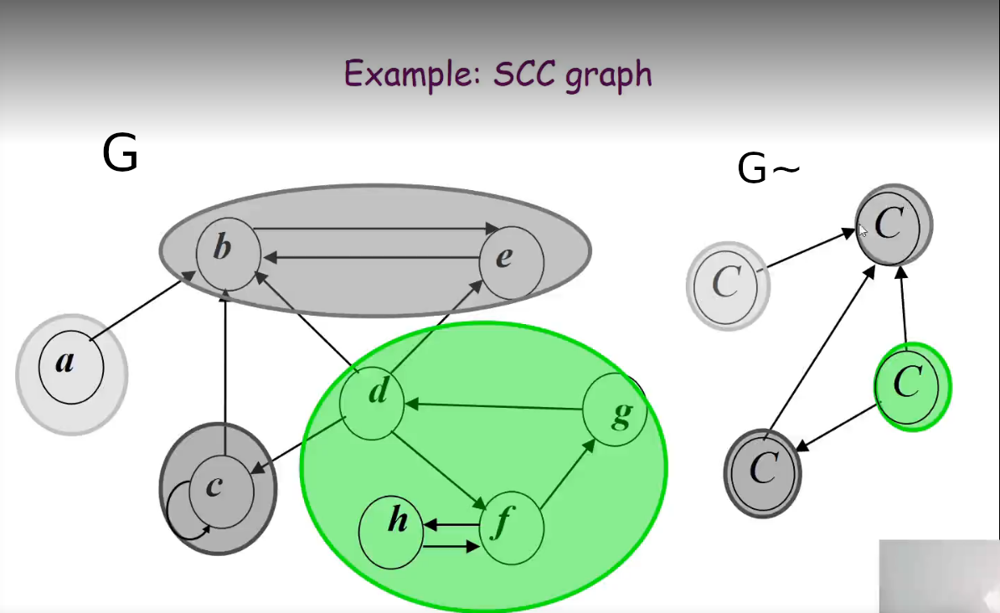

# Grafos

## Variaveis

G -> Grafo<br>
G<sup>R</sup> -> Grafo reverso<br>
n -> Nos<br>
m -> Arestas<br>
u,v,w -> Nos quaisquer do grafo<br>
d(u) -> Grau de u, quantidade de vizinhos de u<br>
V<sub>1</sub>, ... ,V<sub>n</sub> -> Lista de nos<br>


## Representacao

### Lista de adjacencias

operacao | custo computacional
 ----  | :----:
Checar se tem aresta de u - > v  | O(d(u))
Identificar todas as arestas | O(n + <del>2</del>m)
Armazenamento em memoria | O(n + <del>2</del> m)

### Matriz de adjacencias

operacao | custo computacional
 ----  | :----:
Checar se tem aresta de u - > v  | O(1)
Identificar todas as arestas | O(n<sup>2</sup>)
Armazenamento em memoria | O(n<sup>2</sup>)
## Conceitos
conceito | definicao
--- | ---
caminho | conjunto de nos ligados por arestas 
caminho simples | menor caminho com nos distintos
grafo nao direcionado conectado \| grafo conexo | existe um caminho entre quaisquer nos u e v
ciclo | caminho com 3 ou mais nos distintos em que o primeiro e ultimo elemento sao identicos
distancia u -> v | caminho simples de u -> v
arvore | Grafo conexo que nao possui ciclos
conjunto conectado | S e conectado se somente se v e atingido por u e u e atingido por v para doto u,v em S
componente conectado | S e componente conectado se somente se S e conjunto conectado e para cada u em V - S, S UNIAO {u} e nao conectado

Teorema: se duas das seguintes propriedades forem verdadeiras, a terceira tambem sera.
- G e conectado
- G nao tem ciclos
- G possui n - 1 arestas

Somatorio de graus dos nos: 2*m
## BFS & DFS
Breadth First Search ([BFS](cpp/bfs.cpp)) -> Pode ser implementado com uma fila, tem complexidade O(n + m)

Deapth First Search ([DFS](cpp/dfs.cpp)) -> Pode ser implementado com uma pilha ou com recursao, tem complexidade O(n + m)

Enquanto o BFS atravessa o grafo com 'camadas', o DFS avanca ate um 'beco sem saida' e retorna na recursao.

Templates:

BFS/DFS(G) -> retorna as arvores produzidas pelos algoritmos
BFS/DFS(G,u) -> retorna uma das arvores
BFS/DFS(G,u,v) -> retorna a distancia ou o caminho entre u e v


[flood_fill](cpp/flood_fill.cpp) -> algoritmo que determina a area conectada em uma matriz, pode ser implementado com pilha, recursao ou fila.

Seja T uma arvore gerada por uma DFS em G e v - > w uma aresta de G. Se v e visitado antes de w entao v e ancestral de w em t.

Seja T uma arvore gerada por uma DFS em G e existe um caminho entre v e w em G e ve e visitado antes de w entao nao necessariamente v e ancestral de w em T.

## Grafo bipartido

G e bipartido se e nao direcionado e seus nos podem ser coloridos de verde e amarelo de tal forma que as arestas conectam nos verdes apenas a nos amarelos.

Se um grafo e bipartido ele nao tem ciclo de tamanho impar.

Se rodar um BFS em um grafo bipartido as camadas nao terao nos que se ligam

## Grafo direcionado

Se diz que um grafo e fortemente conectado se este e direcionado e conectado.

Lema: G e fortemente conectado se u atinge todos os nos e todos os nos atingem u.

### Algoritmo para verificar se G e fortemente conectado
complexidade computacional: O(n + m)
- Pegue um no u
- Roda um BFS a partir de u em G
- Roda um BFS a partir de u em G<sup>R</sup>
- Retornar true se u atinge todos os nos em ambos BFS

O algoritmo para obter Grafo reverso G<sup>R</sup> tambem tem complexidade O(n + m)

## Directed Acyclic Graph (DAG)

Restricao de precedencia: Aresta(u,v) obrigatoriamente quer dizer que u e antecessor de v.

Um grafo esta ordenado topologicamente se :
- G e direcionado
- V<sub>1</sub>, ... ,V<sub>n</sub> estao em ordem

Lema: se G tem ordenacao topologica, entao G e DAG.

Lema: se G e DAG, entao G tem ordenacao topologica

Lema: se G e DAG entao G nao tem nos com arestas que apontam para a esquerda.

Em um DAG existe um no que nenhuma aresta aponta para ele.

### Algoritomo de Ordenacao Topologica
complexidade computacional : O(n + m)

1. Encontre v que nao tem aresta apontando para ele
2. Delete v de G
3. Adicione v em uma lista
4. Repita o passo 1 ate n == 0

Pseudo codigo
```
i = 0
while i < n:
    // s -> conjunto de nos com 0 arestas
    // count -> vetor com arestas de cada no
    v = no_menor_grau(count,s)
    if grau(v) != 0:
        return NotDAG
    ans_vector.append(v)
    remove(G,v)
    att_count(count,v)
    i++
```
Passos obtencao de no de menor grau
```
Variaveis:
    count - > array com numero de arestas que apontam para v[i]
    s - > conjunto de nos com 0 arestas

Inicializacao: de count e s em O(n + m)
Atualizacao: O(1)
    - Remove v de s
    - Decrementa count de todas as arestas de v -> w
```
## Strongly connected components (SCC)

Para criar exemplos para testar ideias em grafos fracamente conectados faca um ciclo (a, b, c) conecte o ciclo com uma aresa em outro ciclo (d,e,f).

G~ Grafo gerado pelos conjuntos conectados


sink node - > no so recebe aresta

source node -> no so tem aresta origem 

### DFS Numbering

DFS com 2 vetores auxiliares para numerar a entrada e saida da chamada de funcao para cada no.

```
Global time

DFS(G)
    time = 1
    for n in G
        if visited[n] 
            DFS_Visit(G,n)
DFS_Visit(G,u)
   visited[u] = true
   pre[u] = time++
   for w in G[u]
        if visited[w]
            InserirArestaArvore(u,w)
            DFS_Visit(G,w)
    pos[u] = time++
```

Propriedade: Se C e D sao componentes fortemente conectados e existe uma aresta de um no de C para um no de D, entao o maior post() em C é maior que o maior post() em D.

Colorario: O no de G com maior post() é um no pertencente a um source node de G~.

Observação 1: Componentes fortemente conectados em G e G<sup>R</sup> são os mesmos.

Observação 2: Se um no pertence a um source node de G~ entao ele pertence a um sink node em (G<sup>R</sup>)~

### SCC algorithm

1. DFS(G) computar post[u]
1. Computar G<sup>R</sup>
1. DFS(G<sup>R</sup>) na ordem decrescente post[v]
1. Disponibilizar os vertices de cada arvore como um SCC

## Dijkstra

- Manter conjunto de nos explorados S, que tem a distancia d(u) minima entre u - > w.
- Inicializar conjunto de explorados S = { s }, d(s) = 0.
- Repetidamente escolher o no nao explorado v que minimize a distancia.

## Minimum Spanning Tree

Arvore geradora minima: dado um grafo conectado ponderado uma MST é um subconjunto de arestas tais que T é MST em que a soma do peso das arestas é minimizado.

Algoritmos gananciosos:
- Kruskal's 

    Comece com T = {}. Considere as arestas em ordem ascendente de peso. Insira uma aresta em T a nao ser que ao fazer isto um ciclo seja criado.

- Reverse-Delete 

    Comece com T = G. Conseidere as arestas em ordem decrescente de peso. Delete a aresta de T a nao ser que fazendo isto T seja um grafo disconectado.

- Prim's

    Comece em um no qualquer, insira em T de maneira gananciosa. Em cada passo adicione a aresta mais barata em T ate o ponto final.