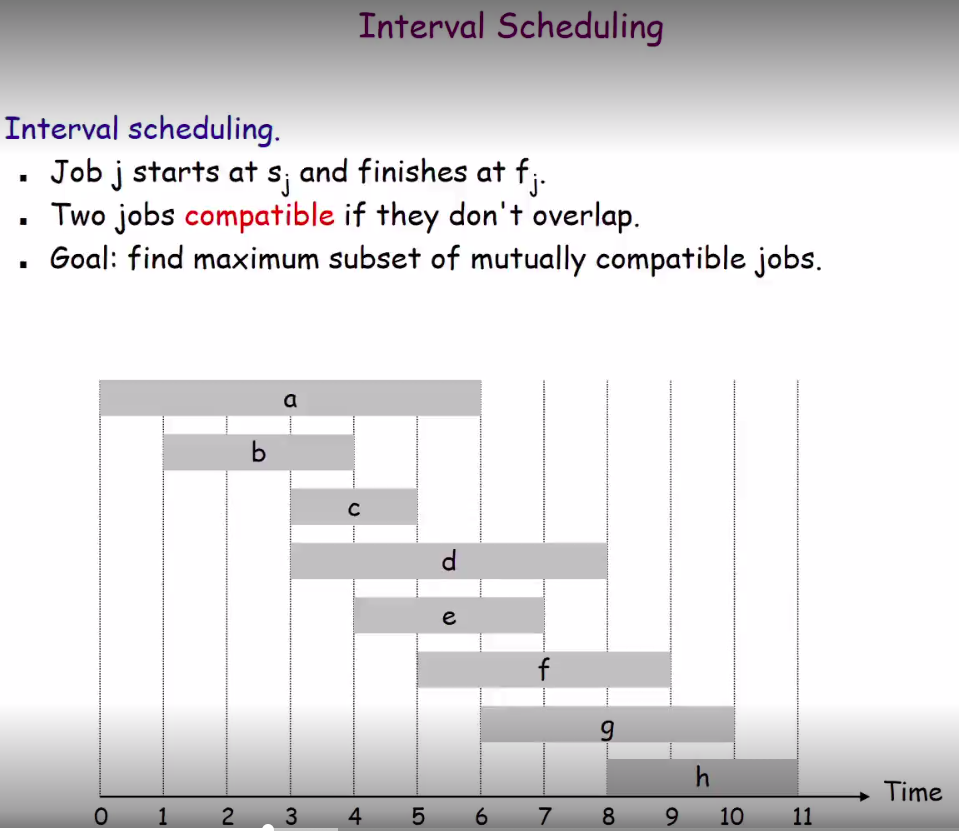
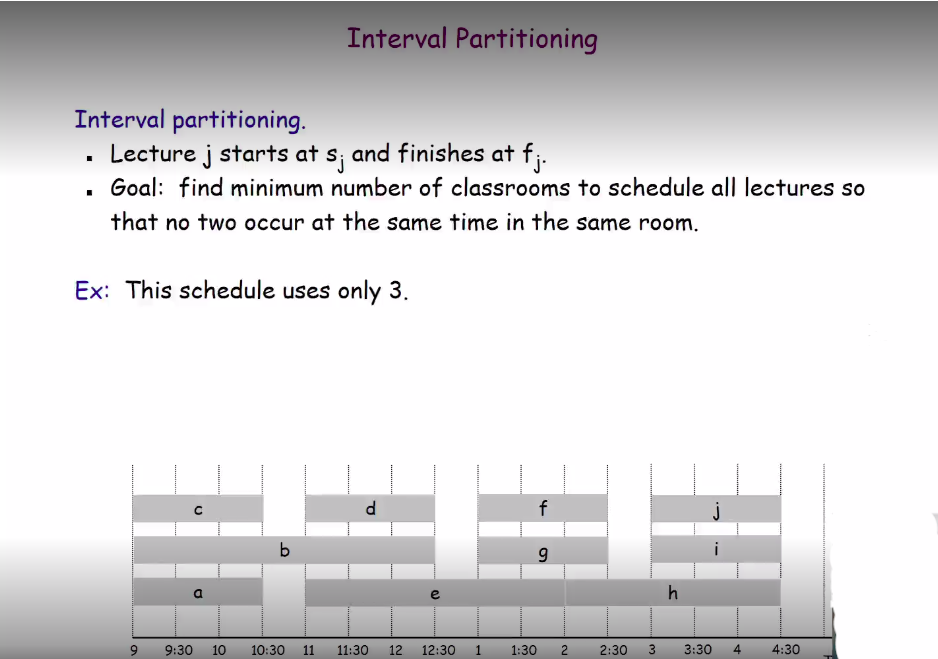
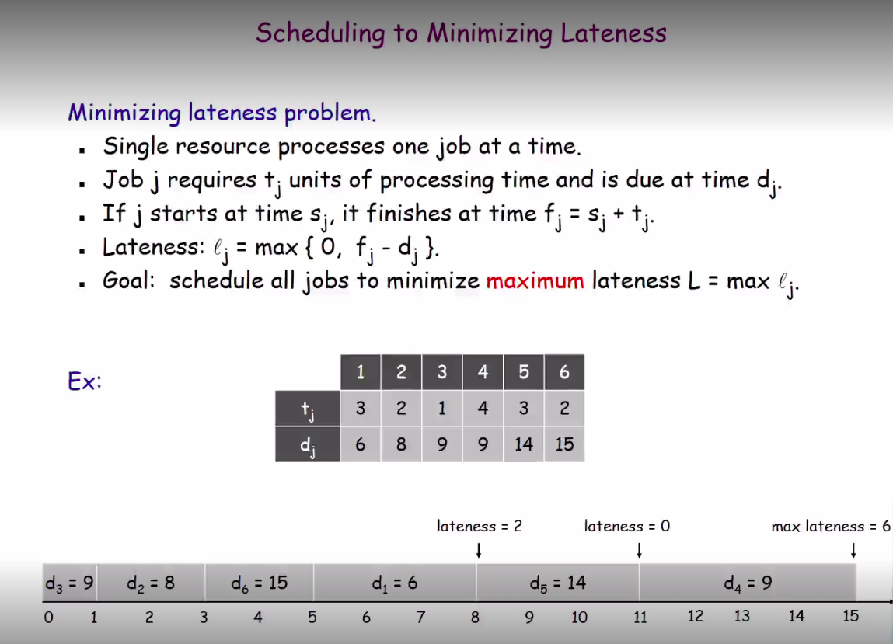
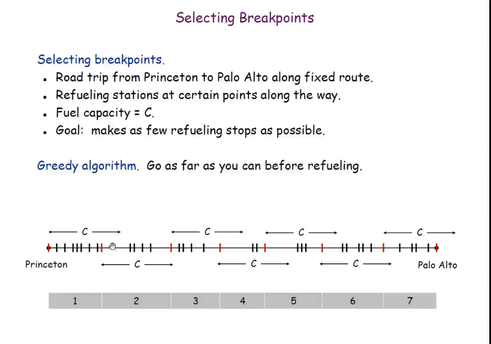

# Algoritmos ambiciosos

## Greddy template

- Considere as tarefas em alguma ordem
- Pegue cada atividade na ordem selecionada
- Enquanto der errado troque o criterio de ordenacao ate encontrar a solucao.

Como selecionar a melhor ordem ? Procure criar contra exemplos de cada ordenacao

## Greedy Analysis Strategies

- Greedy algorithm stays ahead: 
  Mostrar que a solucao gananciosa e  tao boa quanto qualquer outro algoritmo
- Exchange argument:
  Gradualmente transforme qualquer solucao do problema em um algoritmo ganancioso.
- Structural: 
  Encontre uma estrutura de borda que toda solucao deve possuir, entao mostre que o seu algoritmo encontra esta borda.

## Interval Scheduling

  
No problemca Interval scheduling os candidatos de ordenacao de objetos sao:

- start time
- finish time
- shortest interval
- fewest conflicts

## Interval Partitioning

Ideia inicial de codigo O(n^2 * log(n)): 
 - Rodar um interval scheduling
 - Inserir toda as a aulas pegas em uma sala
 - Faca o passo 1 ate o numero de aulas ser 0

Codigo ganancioso ideal:
  - Verificar o maximo de intersecoes nos horarios e o numero de salas sera max(intersec)

## Scheduling to minimizing lateness

Codigo ganancioso:
 - Ordenar por deadline
 - Resolver tarefas na lista e contar o atraso positivo.

 ## Knapsack

Se assumir que os itens sao divisiveis e so pegar o item com maior rendimento e usar o algoritmo ganancioso.

## Coin Change

Selecionar a maior moeda.

## Selecting Breakpoints

Ir o mais longe o possivel antes de abastecer.