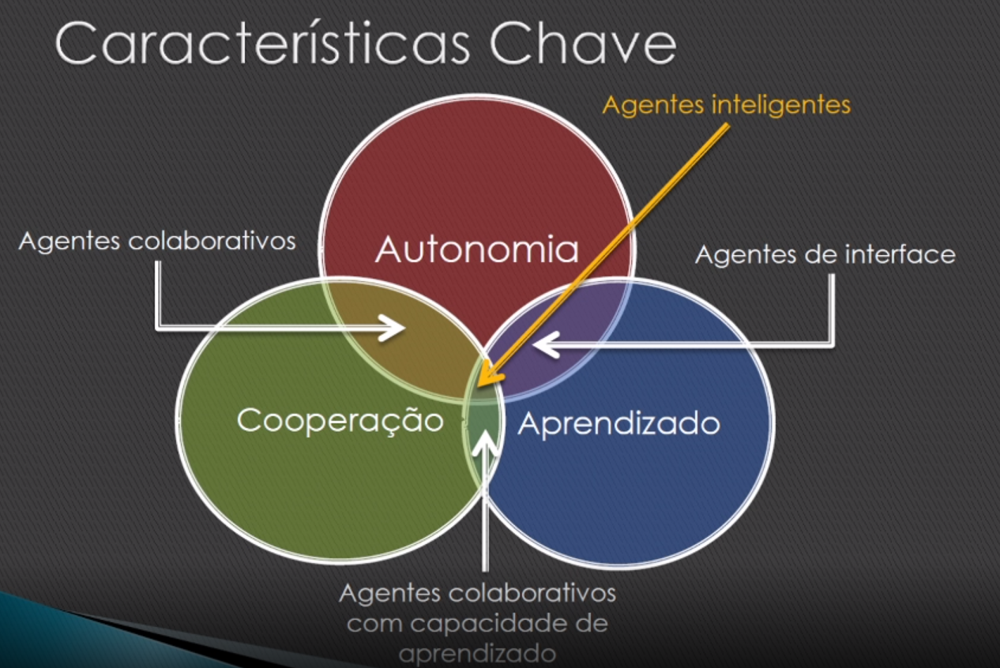

# SMA

## Agente

- Atua em um ambiente
- Tem visão parcial do ambiente
- Percebe mudanças no ambiente
- Adapta-se ao ambiente
- Comunica-se com outros agentes
- Atua de forma autônoma, não é mandado
- Orientado por um conjunto de objetivos e comportamentos
- Aprende a raciocinar e se movimentar

### Conceitos

- Agente pode não responder
- Agentes se comunicam por trocas de mensagens
- Ele pode mentir
- Quanto mais interatividade menor autonomia, tem que balancear isso
- Agentes são reativos e proativos, também tem que balancear isso.

### Propriedades

- Mobilidade
- Raciocínio
- Aprendizagem
